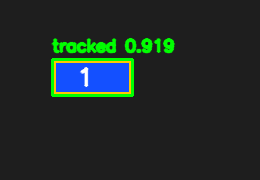
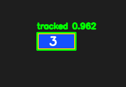

# Waldo

Version: `1.0.0`

`waldo` tracks a moving region of interest across either a folder of image frames or a video file.
It is packaged as a distributable Python module and includes `waldo.py` as a wrapper entrypoint.

## Current Status

- The tracker core is implemented and usable as version `1.0.0`.
- Packaging is PEP 517-first through `pyproject.toml`, with `setup.py` retained as a compatibility shim for older setuptools-based tooling.
- The PEP 517 workflow uses `pep517_backend.py` as the local build backend shim so setuptools wheel/sdist finalization can fall back cleanly when this environment raises `EXDEV` on `rename`.
- Runtime and development/build dependencies are split between `requirements.txt` and `requirements-dev.txt`.
- Installation and release guidance are documented in `INSTALL`.
- Release tarball contents are controlled explicitly through `MANIFEST.in`.
- Local build and install work in this environment through the documented wheel-build-then-install fallback, because direct `pip install .` can still fail in pip's wheel-cache finalization.

## Installation

```bash
.venv/bin/pip install -r requirements.txt
```

Development/build toolchain:

```bash
.venv/bin/pip install -r requirements-dev.txt
```

PEP 517 build/install in this environment:

```bash
TMPDIR=/home/weerdmonk/Projects/waldo/tmp .venv/bin/python -m build --no-isolation
.venv/bin/pip install --no-deps dist/waldo-1.0.0-py3-none-any.whl
```

This flow uses `pyproject.toml` together with `pep517_backend.py`. The backend shim is part of the source distribution and is required for the documented local workaround in environments where backend artifact finalization can hit `EXDEV`.

Equivalent helper:

```bash
./scripts/install_local_pep517.sh
```

Compatibility check for older tooling:

```bash
.venv/bin/python setup.py --version
```

## Usage

Track from a frames folder using a template image:

```bash
.venv/bin/waldo \
  --frames-dir /path/to/frames \
  --template /path/to/template.png \
  --output-csv tracks.csv \
  --debug-dir debug_frames \
  --debug-every 10
```

Track from a video using a first-frame bounding box:

```bash
.venv/bin/waldo \
  --video /path/to/video.mp4 \
  --init-bbox 120,80,240,90 \
  --output-csv tracks.csv
```

Version check:

```bash
.venv/bin/waldo --version
```

The CSV contains:

- `frame_index`
- `frame_id`
- `x,y,w,h`
- `confidence`
- `status` (`tracked`, `redetected`, `missing`)

## Example Images

ROI template used for matching:


Second input frame:


Second debug frame with tracked ROI overlay:



Fourth input frame:


Fourth debug frame with tracked ROI overlay:



Example CSV output:

- `examples/roi_test/tracks.csv`

## Features

- The tracker uses OpenCV normalized template matching with a local search window and periodic full-frame re-detection.
- It maintains both the original template and a slowly refreshed recent template so small text/content changes can be tolerated.
- If confidence falls below `--min-confidence`, the frame is marked `missing`.
- Omit `--debug-dir` or pass `--no-debug-images` to skip annotated image output entirely.
- Use `--debug-every N` to only save every Nth debug frame.

## Project Layout

- `waldo/`: packaged application code
- `waldo.py`: wrapper entrypoint
- `pyproject.toml`: primary PEP 517 packaging metadata
- `pep517_backend.py`: local PEP 517 backend shim for the filesystem rename workaround
- `setup.py`: compatibility shim for older tooling
- `INSTALL`: installation and release checklist
- `MANIFEST.in`: explicit sdist allowlist
- `.gitignore`: local/build artifact exclusions

## Notes

- In this environment, `pip install .` can still fail after a successful PEP 517 wheel build because pip's own wheel-cache finalization hits `EXDEV`; the supported local workaround is `python -m build --no-isolation` followed by `pip install --no-deps dist/*.whl`.
- `pep517_backend.py` addresses the backend-side rename failure during `python -m build`; it does not patch pip's separate wheel-cache finalization step, which is why the direct wheel-install fallback is still documented.
